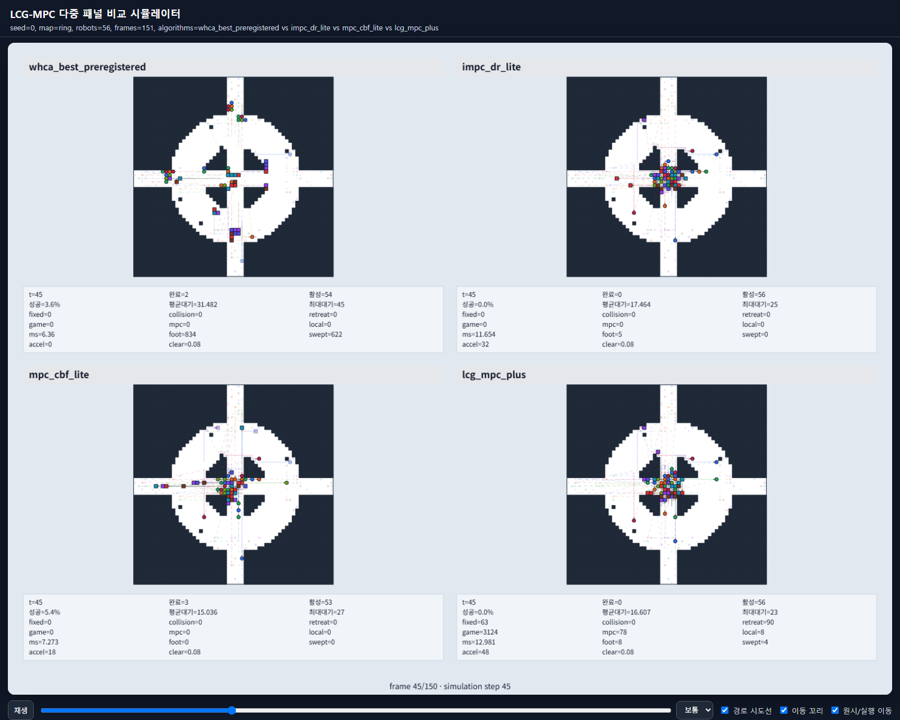
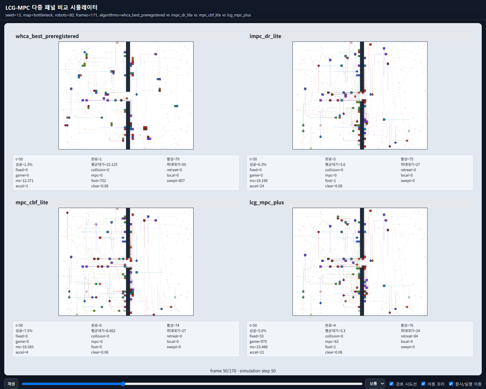
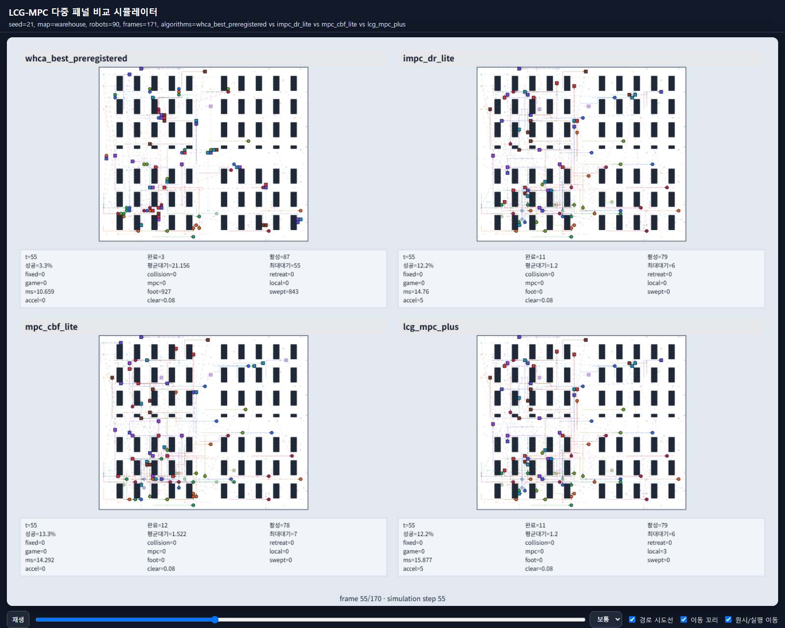

# Inha University & RODIX Inc, Anders Hwang

# Visualization Artifacts

This directory contains visualization artifacts for the LCG-MPC+ multi-robot deadlock-recovery study.

## Sample Images

These screenshots were rendered from the actual interactive HTML viewers at mid-simulation frames.

| Ring crossing | Bottleneck swap | Warehouse aisles |
| --- | --- | --- |
|  |  |  |

## Directory Layout

- `interactive_4way_html/`: standalone HTML Canvas animations comparing four planners on the same scenario.
- `paper_figures_1000seed/`: PNG and PDF figures generated from the completed 1000-seed paired experiment.
- `captions/`: draft figure and table captions for manuscript integration.
- `sample_images/`: static screenshots captured from the interactive HTML visualizations.

## Interactive 4-Way HTML Animations

Open `interactive_4way_html/index.html` in a web browser, then select one of the five scenarios:

- ring crossing, 56 robots, seed 0
- intersection crossing, 72 robots, seed 7
- bottleneck swap, 80 robots, seed 13
- warehouse aisles, 90 robots, seed 21
- corridor opposing flow, 60 robots, seed 42

Each HTML file compares:

- WHCA best preregistered
- IMPC-DR-lite
- MPC-CBF-lite
- LCG-MPC+

Controls:

- Space: play or pause
- Left/right arrows: move one simulation step
- Checkboxes: toggle path, intent, and tail overlays
- Optional URL query: append `?frame=50` to open a specific starting frame

The animations provide qualitative behavior views. Quantitative claims are based on the statistical 1000-seed results.

## Paper Figures

The `paper_figures_1000seed/` folder includes both PNG and PDF versions for:

- success rate
- mean wait time
- throughput per step
- average step runtime
- supervisor interventions
- Jain wait fairness

Figures are split by 56-robot and 100-robot settings and include bootstrap confidence intervals.

## Reproduction

The interactive HTML suite can be regenerated with:

```bash
python scripts/visualize_suite.py --config configs/visual_4way_5cases.yaml
```

The paper figures are produced by the final manuscript packaging workflow:

```bash
python scripts/prepare_paper_ready_1000seed.py
```
